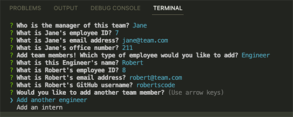
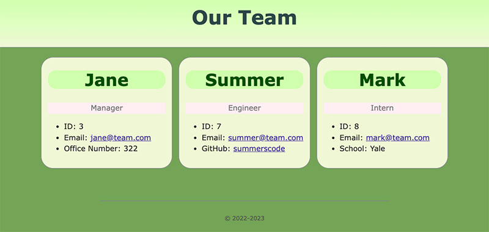

# visual-roster-generator

## Description

I created this CLI based application so that one can easily generate an HTML page that displays the members of their team along with pertinent information for each team member by asnwering a series of questions related to their team.

## Table of contents

- [Description](#description)
- [Usage](#usage)
- [Installation](#installation)
- [Tests](#tests)
- [Visuals](#visuals)
- [Questions](#questions)
- [License](#license)

## Usage

To use this application you must have node.js as well as inquirer version 2.8.4 installed. To run the application, navigate to the root of the application's directory and run the command

        node index.js

in the terminal. Next, take the time to answer all of the questions, adding relevant members of your team and their information. After you have completed this process for all team members and selected the "my team is complete" option when prompted to add more team members, your visual team roster will be generated for you. You will find it in the dist folder with the name "team.html".

## Installation

Please visit [https://nodejs.org/en/download/](https://nodejs.org/en/download/) for instructions on installing node.js on your computer. To install inquirer, run the command

        npm i inquirer@8.2.4.

## Tests

I have written tests for all classes in my application. These tests can be found in the **tests** folder. Please see my [demo video](https://drive.google.com/file/d/1jPjOBnsQrAUf1xbMwOOes5H2l5csAu69/view) which shows these tests being run with passing results.

## Visuals

[watch demo video](https://drive.google.com/file/d/1HK-xDGxvaFY6puBNnH5gIWwUiDWVdnm1/view)

## Questions

For any further questions please reach out via:

[Github](https://github.com/mariahmcdaniel)

[Email](mailto:mariahmcdaniel@icloud.com)

## License

This application is using MIT License. for more information please visit https://opensource.org/licenses/MIT.
